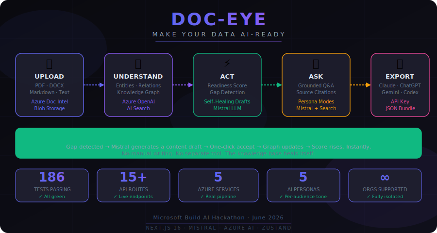
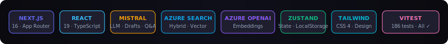
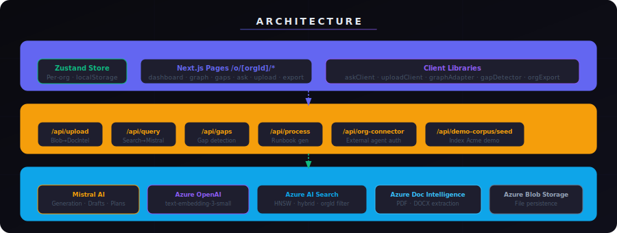

# DOC-EYE — Make Your Data AI-Ready

<p align="center">
  
</p>

<p align="center">
  
</p>

---

## 🏆 Judge Pitch

> **The problem:** Enterprises sit on mountains of documents — PDFs, playbooks, policy files, runbooks — but that knowledge is invisible to AI. Most AI deployments either hallucinate because they have no grounding, or fail entirely because the data isn’t ready.

**DOC-EYE is an enterprise knowledge intelligence platform** that turns your documents into an AI-ready knowledge graph — per organization, fully isolated, and usable by any AI agent.

### Upload → Understand → Act → Take it anywhere

| Stage | What happens | Powered by |
|---|---|---|
| 📄 **Upload** | Multi-format ingestion, extraction, vector embedding, indexing | Azure Doc Intelligence · Azure Blob · Azure OpenAI |
| 🔍 **Understand** | Interactive knowledge graph · entity extraction · AI readiness score + timeline | react-force-graph-2d · Zustand |
| ⚡ **Act** | Gap detection with business impact · AI draft generation · one-click close | Mistral · gapDetector |
| 💬 **Ask** | Grounded Q&A with source citations · persona-aware answers | Mistral · Azure AI Search |
| 🚀 **Export** | JSON bundle · live API key · connector endpoint for any AI agent | org-connector API |

### ✦ Self-Healing Knowledge Base

> DOC-EYE doesn’t just find gaps — **it fixes them.**
> When a gap is detected, Mistral generates a ready-to-use content draft inline. Accept it with one click and the gap closes, the graph updates, and the readiness score rises immediately.
> **No manual writing. No separate tool. The system heals itself.**

### What makes this different

- **Real Azure AI pipeline** — upload a document and it is indexed and queryable in seconds
- **Per-org isolation** — every document, entity, gap, and query is strictly scoped by `orgId`
- **Persona-aware responses** — switch between Leadership, Engineering, HR, Compliance personas and watch the same answer adapt its tone
- **186 tests, all passing** — production-grade reliability with full CI gate

---

## 🗂 Project Description

DOC-EYE solves three problems enterprises face when preparing data for AI:

```
❌ Knowledge scattered across siloed files  →  ✅ Unified org-scoped knowledge graph
❌ No way to assess AI-readiness            →  ✅ Scored on completeness · connectivity · quality · metadata
❌ Hallucinated, ungrounded AI answers      →  ✅ Grounded Q&A with exact source citations
```

---

## 🚀 Setup Instructions

### Prerequisites

- Node.js 20+
- Azure resources: AI Search · OpenAI embeddings · Blob Storage · Document Intelligence
- Mistral API key

### Install & run

```bash
git clone <your-repo-url>
cd Doc-eye
npm install
cp .env.example .env.local   # fill in your keys
npm run dev                  # http://localhost:3000
```

### Environment variables

```env
MISTRAL_API_KEY=
AZURE_OPENAI_EMBEDDING_ENDPOINT=
AZURE_OPENAI_EMBEDDING_API_KEY=
AZURE_OPENAI_EMBEDDING_DEPLOYMENT=text-embedding-3-small
AZURE_SEARCH_ENDPOINT=
AZURE_SEARCH_API_KEY=
AZURE_SEARCH_INDEX_NAME=doc-eye-index
AZURE_DOCUMENT_INTELLIGENCE_ENDPOINT=
AZURE_DOCUMENT_INTELLIGENCE_KEY=
AZURE_STORAGE_CONNECTION_STRING=
AZURE_STORAGE_CONTAINER=
```

### Seed demo corpus & validate

```bash
npm run seed:demo-azure          # index Acme Consulting into Azure Search
node scripts/test-endpoints.mjs  # smoke-test all Azure + Mistral endpoints
npm run verify                   # lint + typecheck + 186 tests + build
```

---

## 🏗 Architecture

<p align="center">
  
</p>

<details>
<summary><strong>Layer details</strong></summary>

**Browser layer**
- Zustand store holds per-org documents, entities, relationships, gaps, score, and history — persisted to `localStorage`
- Next.js App Router pages under `/o/[orgId]/*` — dashboard, graph, gaps, ask, upload, export
- Client libs (`askClient`, `uploadClient`, `graphAdapter`, `gapDetector`, `orgExport`) abstract all API calls with graceful fallbacks

**API layer (Next.js server)**

| Route | Purpose |
|---|---|
| `POST /api/upload` | Blob → Doc Intel → embeddings → AI Search index |
| `POST /api/query` | Azure Search retrieval → Mistral answer generation |
| `GET  /api/gaps` | Server-side gap scan across indexed documents |
| `POST /api/process` | Mistral-generated runbook / process plan |
| `GET  /api/org-connector` | External AI agent auth endpoint |
| `POST /api/demo-corpus/seed` | Index Acme Consulting demo into Azure Search |

**Azure AI layer**
- Mistral `mistral-small-latest` — generation, drafts, process plans
- Azure OpenAI `text-embedding-3-small` — vector embeddings
- Azure AI Search — HNSW hybrid retrieval, filtered by `orgId`
- Azure Document Intelligence — PDF and DOCX content extraction
- Azure Blob Storage — file persistence

</details>

---

## 🤖 AI Tools Used

| Tool | Role in DOC-EYE |
|---|---|
| **Mistral** (`mistral-small-latest`) | Grounded answer generation, gap-closing draft content, process plan generation |
| **Azure OpenAI** (`text-embedding-3-small`) | Vector embeddings for all uploaded documents |
| **Azure AI Search** | Hybrid keyword + vector retrieval, org-scoped filtering |
| **Azure Document Intelligence** | PDF and DOCX content extraction in the upload pipeline |
| **Persona system** | Per-audience prompt shaping — Leadership, Engineering, HR, Compliance, Customer |

---

## 📦 Dependencies

<details>
<summary><strong>Runtime packages</strong></summary>

| Package | Purpose |
|---|---|
| `next` 16.2.7 | App framework with App Router |
| `react` 19 / `react-dom` 19 | UI rendering |
| `zustand` | Client-side org state |
| `framer-motion` | Animated transitions |
| `recharts` | Readiness score charts |
| `react-force-graph-2d` | Interactive knowledge graph |
| `lucide-react` | Icons |
| `mammoth` | DOCX parsing |
| `uuid` | Stable ID generation |
| `@azure/openai` | Embeddings client |
| `@azure/search-documents` | AI Search client |
| `@azure/storage-blob` | Blob upload / read |
| `@azure/ai-form-recognizer` | Document Intelligence client |
| `openai` | Mistral-compatible client |

</details>

<details>
<summary><strong>Dev & testing packages</strong></summary>

`typescript` · `eslint` · `eslint-config-next` · `vitest` · `@testing-library/react` · `@testing-library/user-event` · `@testing-library/jest-dom` · `jsdom`

</details>

---

## 👥 Team

| Name | Role |
|---|---|
| **Siddharth Gupta** | Full-Stack Developer |
| **Tanishq Maheshwari** | Full-Stack Developer |

---

## 💻 Useful Commands

```bash
npm run dev                      # start dev server at localhost:3000
npm run dev:clean                # clear stale .next cache then start
npm run test                     # run Vitest suite
npm run verify                   # full gate — lint + typecheck + tests + build
npm run seed:demo-azure          # re-index Acme demo into Azure Search
node scripts/test-endpoints.mjs  # validate live Azure + Mistral connectivity
```

---

## 📜 License

Private project — Microsoft Build AI Hackathon · June 2026.
